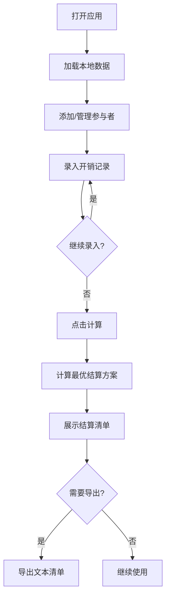

## 1. 产品概述

账单分摊计算器是一款帮助朋友、同事或团队在集体活动后快速、准确计算费用分摊的Web应用。解决多人出行后算账繁琐、容易出错的痛点。

- 核心价值：让账目计算清晰透明，最小化转账次数，避免"人情债"糊涂账
- 目标用户：经常组织或参与集体活动的人群

## 2. 核心功能

### 2.1 功能模块

1. **主页面**：参与者管理、开销记录录入、结算结果展示

### 2.2 页面详情

| 页面名称 | 模块名称 | 功能描述 |
|-----------|-------------|---------------------|
| 主页面 | 参与者管理 | 添加/删除参与者姓名，显示当前参与者列表 |
| 主页面 | 开销录入表单 | 输入金额、选择付款人、选择分摊人员、添加备注 |
| 主页面 | 开销记录列表 | 展示所有已录入的开销，支持删除单条记录 |
| 主页面 | 结算计算按钮 | 一键计算最优结算方案 |
| 主页面 | 结算结果展示 | 清晰展示谁该给谁多少钱，最小化转账次数 |
| 主页面 | 数据导出 | 导出为简单的文本清单 |
| 主页面 | 本地存储 | 自动保存数据到localStorage，下次打开继续 |

## 3. 核心流程

用户打开应用 → 添加参与者姓名 → 逐条录入开销信息（金额、付款人、分摊人）→ 点击计算按钮 → 系统自动计算最优结算方案 → 展示结算清单 → 用户可导出文本或继续编辑

## 4. 用户界面设计

### 4.1 设计风格

- **主色调**：温暖的琥珀色系（#f59e0b）搭配深绿色（#065f46），营造轻松友好的氛围
- **辅助色**：米白色背景（#fefce8），卡片使用柔和的渐变
- **按钮风格**：圆润的胶囊按钮，带有微阴影和悬停动效
- **字体**：标题使用有设计感的衬线字体，正文使用清晰易读的无衬线字体
- **布局风格**：卡片式布局，分区明确，留白充足
- **图标风格**：简洁的线性图标，带有轻松的手绘感

### 4.2 页面设计概述

| 页面名称 | 模块名称 | UI元素 |
|-----------|-------------|-------------|
| 主页面 | 顶部标题区 | 大标题、副标题、温暖渐变背景 |
| 主页面 | 参与者管理卡片 | 输入框、添加按钮、标签式姓名展示、删除按钮 |
| 主页面 | 开销录入卡片 | 金额输入、付款人下拉、分摊人多选、备注输入、添加按钮 |
| 主页面 | 开销列表卡片 | 表格形式展示开销，支持删除 |
| 主页面 | 结算结果卡片 | 醒目的转账列表，付款方/收款方清晰区分 |
| 主页面 | 底部操作区 | 计算按钮、导出按钮、重置按钮 |

### 4.3 响应式设计

- 采用桌面优先设计，移动端自适应
- 卡片在移动端堆叠展示，桌面端可并排
- 触摸操作优化，按钮尺寸适合手指点击

## 5. 算法说明

最优结算算法：
1. 计算每个人的净余额（已付金额 - 应分摊金额）
2. 将所有人分为债权人（正数余额）和债务人（负数余额）
3. 使用贪心算法匹配最大的债权和最大的债务，生成最少的转账次数
4. 确保总转账金额最小化
