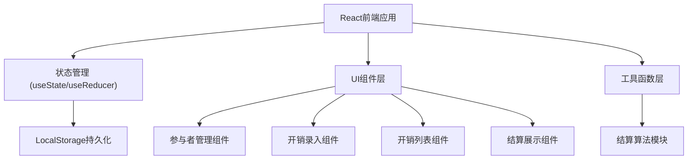
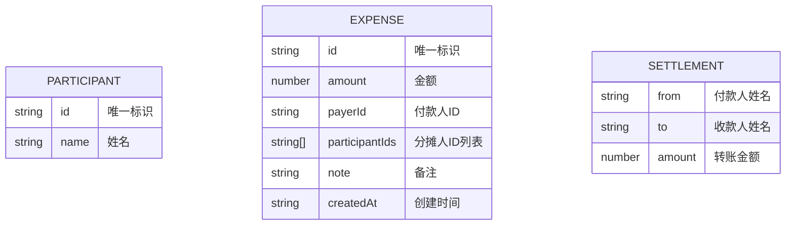

## 1. 架构设计



## 2. 技术描述

- **前端框架**：React@18 + Vite@5
- **样式方案**：TailwindCSS@3
- **状态管理**：React Hooks (useState, useEffect)
- **数据存储**：浏览器 LocalStorage
- **图标**：Lucide React
- **字体**：Google Fonts (Playfair Display + DM Sans)

## 3. 目录结构

```
lc-339-1/
├── src/
│   ├── components/
│   │   ├── ParticipantManager.jsx   # 参与者管理
│   │   ├── ExpenseForm.jsx          # 开销录入表单
│   │   ├── ExpenseList.jsx          # 开销列表
│   │   └── SettlementResult.jsx     # 结算结果展示
│   ├── utils/
│   │   ├── settlement.js            # 结算算法
│   │   └── storage.js               # 本地存储工具
│   ├── App.jsx                      # 主应用组件
│   ├── main.jsx                     # 入口文件
│   └── index.css                    # 全局样式
├── index.html
├── package.json
├── vite.config.js
└── tailwind.config.js
```

## 4. 数据模型

### 4.1 数据结构定义



### 4.2 LocalStorage 存储结构

```javascript
{
  participants: [
    { id: "uuid-1", name: "张三" },
    { id: "uuid-2", name: "李四" }
  ],
  expenses: [
    {
      id: "uuid-exp-1",
      amount: 300,
      payerId: "uuid-1",
      participantIds: ["uuid-1", "uuid-2"],
      note: "午餐",
      createdAt: "2024-01-01T12:00:00.000Z"
    }
  ]
}
```

## 5. 结算算法说明

1. **计算净余额**：
   - 对每个人计算：总付款 - 总分摊 = 净余额
   - 正数表示应收，负数表示应付

2. **贪心匹配算法**：
   - 将所有债权人（正数）和债务人（负数）分别放入两个数组
   - 每次取绝对值最大的债权人和最大的债务人进行匹配
   - 金额取两者绝对值的较小值
   - 扣减后归零的一方移除，剩余的继续匹配
   - 直到所有余额清零

3. **算法特点**：
   - 时间复杂度：O(n log n)，主要来自排序
   - 空间复杂度：O(n)
   - 保证转账次数最少（≤ n-1 次）
